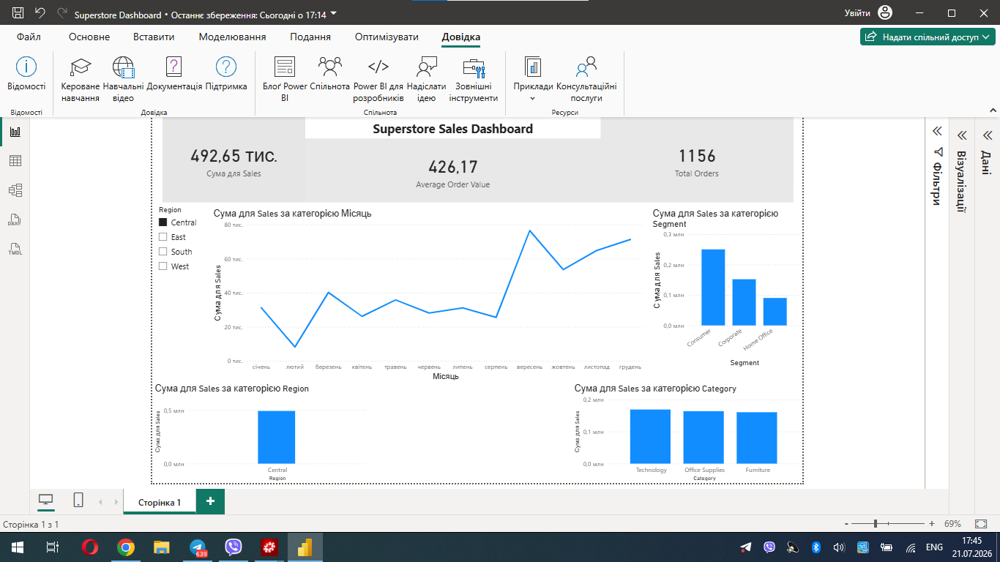

# Superstore Sales Dashboard

## Project Overview

This project analyzes Superstore sales data using Power BI.

The dashboard provides interactive visualizations to analyze sales performance, customer segments, product categories, and regional trends.

## Business Questions

- How do sales change over time?
- Which customer segment generates the highest sales?
- Which product category performs best?
- Which region has the highest sales?
- What is the average order value?
- How many total orders were placed?

## Dashboard Preview

## Tools Used

- Power BI
- DAX
- Data Modeling
- Data Visualization

## KPIs

- Total Sales
- Average Order Value
- Total Orders

## Dashboard Features

- KPI Cards
- Monthly Sales Trend
- Sales by Segment
- Sales by Category
- Sales by Region
- Interactive Region Filter
